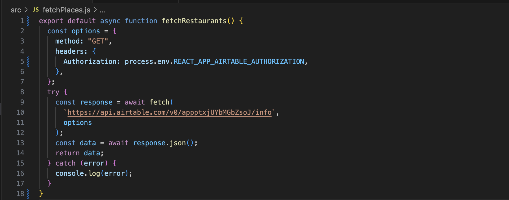

# SAN FRANCISCO BIRTHDAY FREEBIES

🎉 🎁 Unlock a treasure trove of birthday freebies with my website! 🎂 ✨

This website serves as your ultimate guide to discovering establishments that offer complimentary treats on your special day. Whether you're searching for your favorite stores or eager to discover new spots, this platform empowers you to effortlessly locate the perfect spot to celebrate. Join me and make your birthday celebrations even more memorable!

📱 📞 Live application can be found here: https://kristixxg.github.io/bdayfreebies/ 

## Code Sample Screenshots

Secure API Key while fetching data with Async Await. Data organized using [Airtable](https://www.airtable.com/).

React.js implementation of search and filter components. Update outputs in response to an interaction. 
- useState hook to manage state and update the screen
- the array map() function to render lists of components
- conditional rendering using ternary operator
- stying with TailwindCSS 
- React individual components and use props to comunication data

Store sensitive data from application code using .env and .gitignore the .env file

## Credits

Technologies  
  
 

| 📚 APIs Used |
| :----------- |
| Airtable     |

| 📒 Libraries |
| :----------- |
| TailwindCSS  |
| Flaticons    |

## Author

Kristy Guo [LinkedIn](www.linkedin.com/in/kristixxg) | [GitHub](https://github.com/kristixxg)

## License

Copyright (c) 2023 Kristy Guo

Permission is hereby granted, free of charge, to any person obtaining a copy
of this software and associated documentation files (the "Software"), to deal
in the Software without restriction, including without limitation the rights
to use, copy, modify, merge, publish, distribute, sublicense, and/or sell
copies of the Software, and to permit persons to whom the Software is
furnished to do so, subject to the following conditions:

The above copyright notice and this permission notice shall be included in all
copies or substantial portions of the Software.

THE SOFTWARE IS PROVIDED "AS IS", WITHOUT WARRANTY OF ANY KIND, EXPRESS OR
IMPLIED, INCLUDING BUT NOT LIMITED TO THE WARRANTIES OF MERCHANTABILITY,
FITNESS FOR A PARTICULAR PURPOSE AND NONINFRINGEMENT. IN NO EVENT SHALL THE
AUTHORS OR COPYRIGHT HOLDERS BE LIABLE FOR ANY CLAIM, DAMAGES OR OTHER
LIABILITY, WHETHER IN AN ACTION OF CONTRACT, TORT OR OTHERWISE, ARISING FROM,
OUT OF OR IN CONNECTION WITH THE SOFTWARE OR THE USE OR OTHER DEALINGS IN THE
SOFTWARE.
